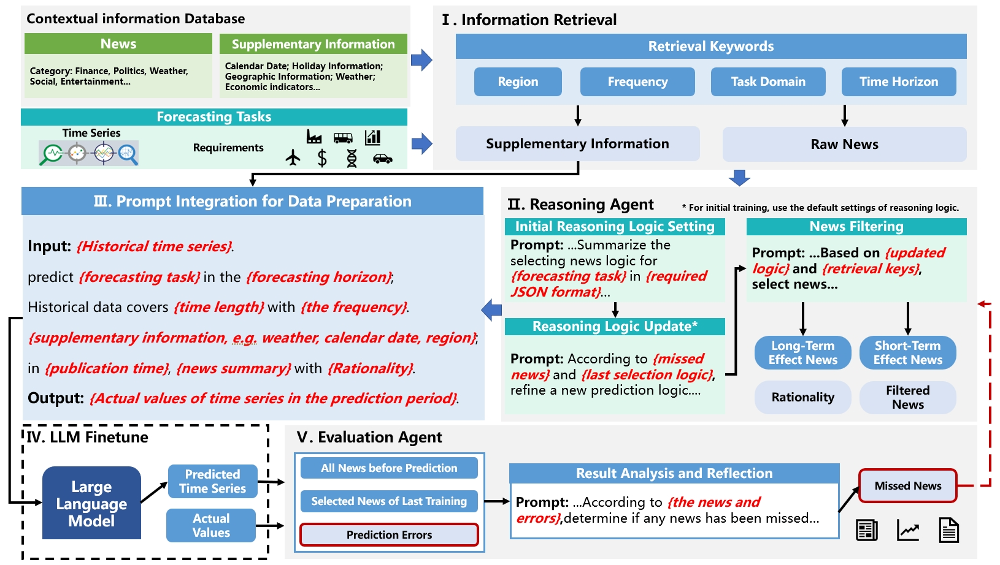
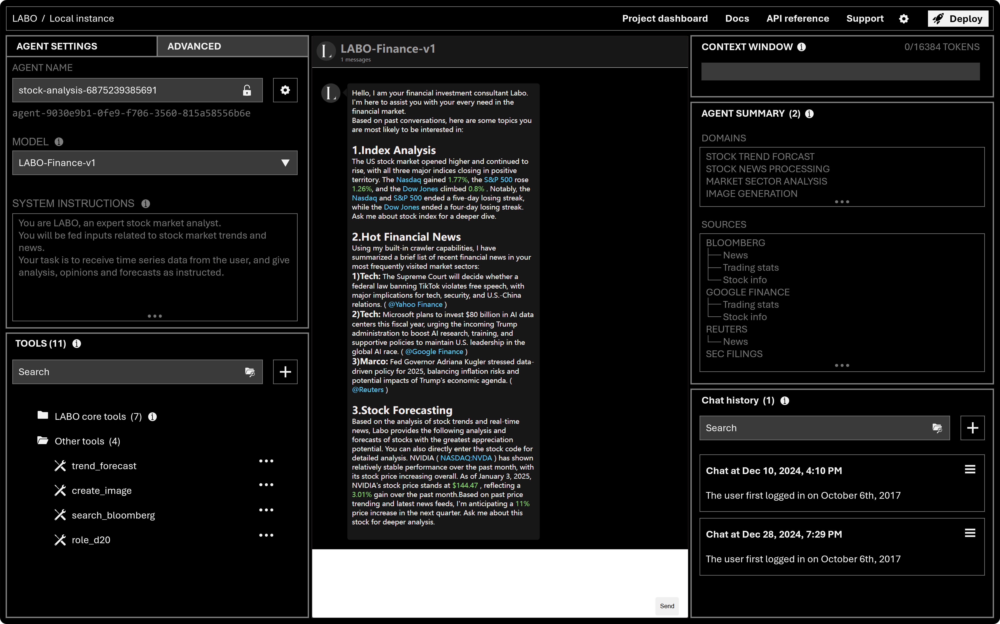

<div align=center>


[](https://x.com/okamotodk)

</div>

## 👾 What is LABO?

### ⌚ LABO: Time Series Forecasting & Analysis Framework 📈

Constructing an LLM agent for time series foretasting holds significant practical value, such as stock market trend prediction, web public opinion analysis, etc. That's why we developed and open sourced ***LABO***, a time-series LLM framework by integrating pre-trained and fine-tuned LLMs with multi-domain agent-based systems.



## ⚡ Simple Example

Using LABO, creating and tuning agents has never been this easy. With a few lines of code, you can set up your own time series data expert for every possible scenario.

```python
from labo import EmbeddingConfig, LLMConfig, create_client
# init client
client = create_client()

# Setting our pretrained TimeSeries LLM and lora fine-tuning finance embedding
client.set_default_llm_config(LLMConfig.default_config(model_name="TimeSeries-LLM"))
client.set_default_embedding_config(EmbeddingConfig.default_config(model_name="finance-lora-embedding"))

# Create an agent
agent = client.create_agent(name='finance-agent')
print(f"Created agent success. name={agent.name}, ID={agent.id}")

# Prompt to the agent and print response
response = client.send_message(
  agent_id=agent.id, 
  role="user", 
  message="Morning, please show me the latest stock market news and analysis."
)
print("Agent messages", response.messages)
```

## 🌖 Quick Start

### Run the LABO server

```shell
# using postgresql to persist your agent
docker run \
  -v ~/data:/var/lib/postgresql/data \
  -p 9870:9870 \
  --env-file .setting \
  labo/labo:latest
```

The LABO agents reside within the LABO server, where their state is persistently stored in a database. You can interact with these LABO agents through the Python API, or by using GUI designed for seamless interaction.

### Develop by GUI

You can also enable GUI mode when deploying the LABO server to launch an agent, such as a trade analysing chatbot. The GUI development allows you to test, debug, and monitor the behavior of agents within your server. Additionally, it serves as a versatile interface for engaging with your LABO agents, offering both functional and exploratory interactions.

```shell
# show GUI with the --enable-gui option
docker run \
  -v ~/data:/var/lib/postgresql/data \
  -p 9870:9870 \
  --env-file .setting \
  --enable-gui \
  labo/labo:finance
```



## 🛠️ Advanced Development

### Fine-tuning your own model

A major pain point of existing large-scale time series models is their inability to perceive sudden temporal information, such as a stock market crash caused by certain scandals.
LABO’s use of Low-Rank Adaptation (LoRA) ensures computational efficiency, allowing the framework to be deployed in resource-constrained environments without compromising predictive accuracy. Additionally, LABO is equipped with a powerful web crawler that updates on a daily granularity, utilizing current events to continuously fine-tune the model and adapt to emerging trends.
Of course, you can also use your own dataset to fine-tune the model and create a domain-specific model tailored to your needs.

```python
python llm-finetune.py \
    --model_name_or_path /data/llm_models/Meta-Llama-Guard-3-8B \
    --tokenizer_name /data/llm_models/llama-2-7b \
    --train_files /data/daily_news/{{DTM}}/train_data/ \
    --validation_files  /data/daily_news/{{DTM}}/valid_data/ \
    --load_in_bits 8 \
    --lora_r 8 \
    --lora_alpha 16 \
    --do_train \
    --do_eval \
    --use_fast_tokenizer true \
    --output_dir ${output_model} \
    --evaluation_strategy  steps \
    --learning_rate 1e-4 \
    --num_train_epochs 1 \
```

### Building your model training pipeline

Another great feature of LABO is python library, ensuring the good versatility of LABO. It can use mature Python libraries to read data, train models, and save models. Here is an example of a code for training a specific financial LLM model.

```python
import transformers

model = transformers.AutoModelForCausalLM.from_pretrained(
    model_args.model_name_or_path,
    from_tf=bool(".ckpt" in model_args.model_name_or_path),
    config=config,
    cache_dir=model_args.cache_dir,
    revision=model_args.model_revision,
    use_auth_token=True if model_args.use_auth_token else None,
    torch_dtype=torch.float16,
    load_in_8bit=True if model_args.load_in_bits == 8 else False,
    quantization_config=bnb_config_4bit if model_args.load_in_bits == 4 else bnb_config_8bit,
    device_map={"": int(os.environ.get("LOCAL_RANK") or 0)}
)

from peft import LoraConfig, PeftModel, get_peft_model
lora_config = LoraConfig(
    r=model_args.lora_r,
    lora_alpha=model_args.lora_alpha,
    target_modules=model_args.target_modules,
    fan_in_fan_out=False,
    lora_dropout=0.05,
    inference_mode=False,
    bias="none",
    task_type="CAUSAL_LM",
)
model = get_peft_model(model, lora_config)


trainer = Trainer(
    model=model,
    args=training_args,
    train_dataset=train_dataset,
    eval_dataset=eval_dataset,
    tokenizer=tokenizer,
    data_collator=transformers.DataCollatorForSeq2Seq(
        tokenizer, pad_to_multiple_of=8, return_tensors="pt", padding=True
    ),
    compute_metrics=compute_metrics,
    preprocess_logits_for_metrics=preprocess_logits_for_metrics,
    callbacks=([SavePeftModelCallback] if isinstance(
        model, PeftModel) else None),
)
```

### Customizing your agent

LABO's flexibility allows easy customization for any need. Want to implement your own agent? Simply follow the instructions, and you're all set!

```python
customized_agent = client.create_agent(
    name="customized_agent", 
    memory=TaskMemory(
        human="My name is Sarah, a football player.", 
        persona="""You are an Interest Persona Agent designed to understand
                   and adapt to the unique interests and preferences of the user.
                   The goal is to provide responses, suggestions,
                   and information that are tailored specifically to the user’s interests.
                   You should aim to engage the user on topics they enjoy
                   and encourage deeper exploration within their areas of interest.""", 
        tasks=["Start calling yourself Bot.", "Tell me the Premier League competition next week."],
    )
)
```
